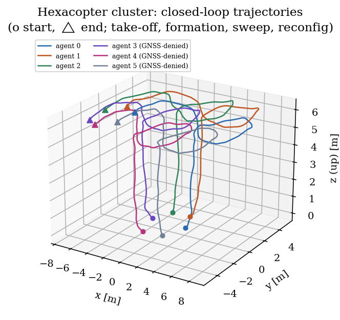
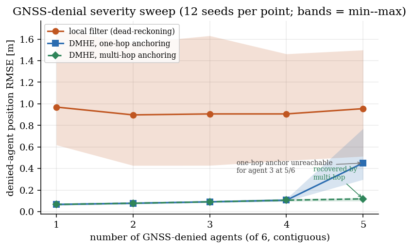

# Distributed Real-Time Estimation and Control for Heterogeneous UAV Clusters

Distributed moving-horizon estimation (DMHE) and distributed model-predictive control (DMPC)
for clusters of **quaternion-modelled hexacopters** and **6-DOF fixed-wing aircraft**, with
constrained real-time solvers as the per-agent computational core.

**[Project site & results](https://anilram30.github.io/uav-cluster-dmpc-dmhe/)** ·
**[SwarmScope — interactive 3D mission replay](https://anilram30.github.io/uav-cluster-dmpc-dmhe/swarmscope.html)** ·
**[Technical report (PDF, 58 pp.)](report/UAV_Cluster_DMPC_DMHE_Report.pdf)**



---

## What this is

Six hexacopters fly a formation mission — take-off, ring assembly, a swept translation and a
contract-and-rotate reconfiguration — while three of them lose GNSS for ten seconds. Each agent
runs its own estimator and its own predictive controller; nothing is centralised. The denied
agents stay localised by fusing *relative* measurements to neighbours that still have an absolute
fix, and the formation holds its collision-free separation throughout. A four-aircraft fixed-wing
cluster flies the same coordination logic on a coordinated-turn echelon loiter.

Everything in this repository runs from a clean checkout with NumPy alone, and every number
quoted below is produced by the code here.

| | |
|---|---|
| **Denied-agent position error through a 10 s GNSS blackout** | **0.088 m** with DMHE vs **1.26 m** dead-reckoning |
| **Monte-Carlo campaign** | 210 runs — **0 divergences, 0 solver failures** |
| **Safety** | min separation **1.55 m** against a 1.40 m barrier radius, 0 breaches |
| **Anchor-coverage failure recovered** | 5-of-6 denied: 0.451 m → **0.119 m** via multi-hop anchoring |
| **Compiled solvers in the closed loop** | ≈ **76 µs** per agent per cycle, behaviour unchanged |

## Highlights

**Vehicle models derived from first principles, and numerically validated.**
A 13-state hexacopter with full Hamilton-quaternion attitude dynamics
(`q̇ = ½ q ⊗ [0, ω]`), Newton–Euler rigid-body dynamics, a rotor thrust/torque model and the
over-actuated six-rotor mixer with its rank structure; and the Beard–McLain 6-DOF fixed-wing
model on the Aerosonde airframe, with the wind triangle, sigmoid-blended stall aerodynamics and
product-of-inertia rotational dynamics. `python/validate_models.py` checks every relation —
quaternion group properties, mixer rank and allocation round-trips, hover equilibrium, energy
consistency, trim — and reports `ALL CHECKS PASSED`.

**Anchor coverage as the structural condition for GNSS-denied resilience.**
The campaign sweeps denial severity from one to five of six agents and degrades the
communication graph. Estimation quality is flat (p95 < 0.12 m) for as long as every denied agent
retains a localised neighbour, and collapses the moment that condition breaks — not gradually
with severity, but discontinuously with graph structure. This is the result the study exists to
show, and it is what the multi-hop extension then repairs: by assigning each agent an *anchor
level* and letting it anchor only to strictly-lower levels (a DAG, so no circular information),
the broken cases return to decimetre accuracy with the safety margin restored.

**A solver boundary that is actually a boundary.**
The coordination layer talks only to `c_api/uav_solver.h` — set the reference, push constraint
rows, prepare, feed back. It never sees how the solver is built. A dependency-free reference
implementation behind that interface ships here, so the whole stack compiles, runs and
reproduces its results with no proprietary component present.

## Repository layout

```
c_api/          C numerical core
  uav_solver.h    the interface: MPC controller + MHE estimator, allocation-free
  uav_solver_ref.c dependency-free reference implementation (LQR + information filter)
cpp/            C++ coordination layer
  agent.hpp       per-agent DMHE relative fusion, consensus, CBF safety filter
  cluster_demo.cpp end-to-end smoke test (4 agents, GNSS blackout)
python/         research layer — models, simulation, campaigns, figures
  uavdmpc/        quaternion · hexacopter · fixedwing · control · estimation · coordination
  validate_models.py   numerical validation of every model relation
  sim_hexacluster.py   6-hexacopter cluster (seed, denied set, topology, ablations)
  sim_fixedwing.py     4-aircraft coordinated loiter
  sim_single_c.py      single-agent compiled-solver-in-the-loop validation
  mc_study.py          robustness campaign (126 runs)
  mc_study2.py         in-the-loop equivalence + multi-hop recovery (84 runs)
  analyze_mc*.py       campaign statistics and figures
  make_figures.py      regenerate every figure
figures/        generated figures
docs/           project website + SwarmScope replay (GitHub Pages)
report/         technical report, public edition (PDF)
```

## Quickstart

```bash
git clone https://github.com/anilram30/uav-cluster-dmpc-dmhe
cd uav-cluster-dmpc-dmhe/python
pip install -r requirements.txt          # numpy, matplotlib

python3 validate_models.py               # -> ALL CHECKS PASSED
python3 sim_hexacluster.py               # 6-hexacopter cluster mission
python3 sim_fixedwing.py                 # fixed-wing echelon loiter
python3 make_figures.py                  # regenerate figures/
```

Scenario knobs are arguments to `sim_hexacluster.run(...)`:

```python
from sim_hexacluster import run
run(seed=7, denied=(3, 4, 5), topology='chords')        # nominal mission
run(denied=(1, 2, 3, 4, 5), topology='ring')            # anchor coverage broken
run(denied=(1, 2, 3, 4, 5), topology='ring', multihop=True)   # ... and recovered
run(ctrl_est='ekf')                                     # ablate the distributed estimator
run(edge_drop=(0, 1))                                   # degraded communication graph
```

The C/C++ stack builds on its own:

```bash
cd cpp && make run
```

Monte-Carlo campaigns (`mc_study.py`, `mc_study2.py`) are resumable and append to
`python/mc_results.json`; the copy in this repository holds all 210 runs, so
`analyze_mc.py` and `analyze_mc2.py` reproduce every reported statistic without re-running them.

## Results

| Scenario | runs | denied-agent RMSE mean/med/p95 [m] | shape err [m] | min sep [m] | breaches | div. |
|---|---|---|---|---|---|---|
| Nominal (3 of 6 denied) | 30 | 0.091 / 0.091 / 0.099 | 0.094 | 1.55 | 0 | 0 |
| 1 of 6 denied | 12 | 0.068 / 0.068 / 0.074 | 0.101 | 1.49 | 0 | 0 |
| 4 of 6 denied | 12 | 0.106 / 0.105 / 0.117 | 0.090 | 1.54 | 0 | 0 |
| 5 of 6 denied — coverage broken | 12 | 0.451 / 0.365 / 0.689 | 0.267 | 0.90 | yes | 0 |
| 5 of 6 denied — multi-hop anchoring | 12 | **0.119 / 0.120 / 0.126** | 0.069 | 1.49 | 0 | 0 |
| Ring graph — coverage broken | 12 | 0.506 / 0.474 / 0.799 | 0.244 | 0.98 | yes | 0 |
| Ring graph — multi-hop anchoring | 12 | **0.111 / 0.112 / 0.119** | 0.100 | 1.49 | 0 | 0 |
| Communication edge dropped | 12 | 0.094 / 0.092 / 0.107 | 0.095 | 1.50 | 0 | 0 |
| Distributed estimator ablated | 12 | 0.089 / 0.087 / 0.099 | **0.449** | **0.75** | yes | 0 |

Substituting the compiled C estimator and controller into the closed loop over 15 paired seeds
reproduces the reference behaviour — estimation error 0.091 m → 0.061 m, shape error and safety
margins unchanged, zero violations — at ≈ 76 µs per agent per cycle measured in the loop.



## A note on the solvers

The per-agent real-time-iteration NMPC controller and MHE estimator used for the in-the-loop and
timing results are my own separate research work — an extension of my MSc thesis on SLQP-MPC,
with the estimator being the moving-horizon counterpart of the same solver. That work is ongoing
and not yet published, so **its algorithms and sources are not part of this repository**, and the
technical report here is a public edition that specifies the solvers by the problem classes they
solve, the real-time pattern they execute in, the interface they are reached through and their
measured timing envelope.

This costs the framework nothing: the distributed estimation and control layers depend only on
the interface in `c_api/uav_solver.h`, and the reference implementations shipped here satisfy it,
so everything in this repository runs and reproduces its results standalone. Any solver meeting
the same interface — including yours — can be dropped in behind it.

## Report

The technical report derives both vehicle models from first principles, builds the DMHE and DMPC
layers with full mathematics and notation defined at the point of use, and presents the complete
simulation study: [`report/UAV_Cluster_DMPC_DMHE_Report.pdf`](report/UAV_Cluster_DMPC_DMHE_Report.pdf).

## Citation

```bibtex
@techreport{anil2026uavcluster,
  author      = {Sreeram Anil},
  title       = {Distributed Real-Time Estimation and Control for Heterogeneous UAV Clusters},
  institution = {Friedrich-Alexander-Universit\"at Erlangen-N\"urnberg},
  year        = {2026},
  note        = {Public edition. Code: https://github.com/anilram30/uav-cluster-dmpc-dmhe}
}
```

## Notes

Parts of this repository — the reference implementation scaffolding, figure generation and the
website — were produced with AI assistance; the models, control and estimation design, study
design and all results are the author's own and were verified against the numerical checks in
`python/validate_models.py` and the campaigns in `python/mc_study*.py`.

## License

MIT — see [LICENSE](LICENSE). The report text and figures are © 2026 Sreeram Anil, shared for
reading and citation.

**Sreeram Anil** — MSc student, FAU Erlangen-Nürnberg · [GitHub](https://github.com/anilram30)
